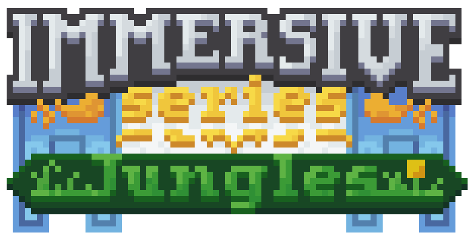
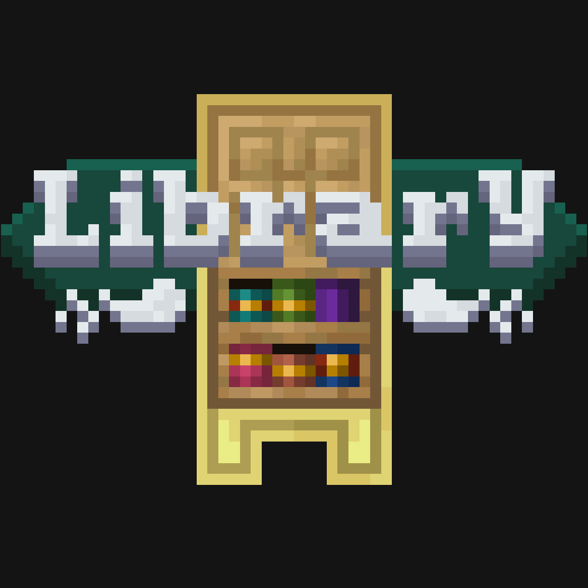

# My Portfolio

## Description

This is the portfolio of James Waller Jr (AKA DistantDig). I wrote all of it myself in HTML and CSS, and included a bit of information about myself as well as a few links to my projects, socials or resume. This project is designed to hold a collection of my own work to compile all of my accomplishments in a single place. While it is still simplistic for now I plan to redesign as time goes on so that it is always an accurate representation of my goals, my projects and my skill level. I'm always looking to grow in my skills, so any contribution or constructive criticism is appreciated!

A link to the deployed project: https://distantdig.github.io/portfolio/

## Content

My portfolio has several of my projects listed as well as some information about myself. As of right now, all of the projects listed are Minecraft mods. Each mod is written in java and json, and each image links to the download page of each mod. From there, there are several links at the top of the page that could be useful. Most notably the 'Files' and 'Source' tabs lead to a downloadable file and the Github repository respectively. It's also useful to note that the 'Issues' tab will send the user directly to the 'Issues' tab in the Github repository for convenient bug reporting. Linking the download page rather than the repository directly is etiquette in the modding community, and is often the primary place to showcase your mod. A screenshot of the tabs on the download page is included below to help grasp this explanation. The source tab is also circled for those who are searching specifically for the Github repository.

**The Github repositories of Immersive Jungles and TreeLib are private per my partner's request, apologies.**

Other than my projects, my portfolio has several links on the page that should prove useful. A link to each section is included at the top of the page for your convenience and my practice. 


## Credits

Some of my projects I partnered with Kekie6 who is *much* more talented than I when it comes to art. Kekie designed the logos, banners and all assets of any projects we worked together on. We also worked side by side on the code aspect of our projects, both helping each other to learn and grow in Java. Rightly so, he deserves the credit for his work. His Github link is [here](https://github.com/Kekie6) for anyone interested.

## Under The Hood

For those of you interested in the code behind this project, it's written in HTML and CSS. This project is one of my first in these coding languages, and so also served as a practice project for myself. Included is an [idex.html](https://github.com/DistantDig/portfolio/blob/main/index.html) and [style.css](https://github.com/DistantDig/portfolio/blob/main/assets/css/style.css) file which collectively work together to bring together the page. Each are organized and spaced out according to my preferences. The HTML file is spaced out by section for readability as such:
```html
<section class="card">
    <a target="#" href="https://www.curseforge.com/minecraft/mc-mods/immersive-jungles">
        
        <span  id="immersive-jungles-content"><p>Minecraft mod coded in Java. I made this one while working with a friend who goes by Kekie6 online. Our newest project.</p></span>
    </a>
</section>

<section class="card">
    <h3>Dig's Dnd Origins</h3>
    <a target="#" href="https://www.curseforge.com/minecraft/mc-mods/digs-dnd-origins">
        
        <span  id="dnd-origins-content"><p>Minecraft mod coded in Java. I made this one on my own and is my most popular project currently.</p></span>
    </a>
</section>

<section class="card">
    <h3>TreeLib</h3>
    <a target="#" href="https://www.curseforge.com/minecraft/mc-mods/tree-lib">
        
        <span  id="treelib-content"><p>Minecraft mod coded in Java. This is another project coded with Kekie6, and is designed to be a library for future mod projects.</p></span>
    </a>
</section>
```

And the CSS file is also organized by category with labeling comments:

```css
/* TreeLib Project */

.treelib-image {
    display: block;
    border-radius: var(--border-curve);
    margin-left: auto;
    margin-right: auto;
    height: 80%;
}

.treelib-image:hover {
    box-shadow: 0 0 5px 5px var(--color-third);
}

.card a:hover #treelib-content {
    visibility: visible;
    opacity: 1;
}
```

Beside how I organized my code, I also had a list of goals to meet for the project. One of which was to learn more of how to use CSS effectively since I struggle with it the most. I had some issues with getting the entire page to fit within the viewport despite changing the size. Although it's still not perfect, I did manage to organize the page once a size threshold is crossed. In a regular desktop view, the page is organized in a grid display and the headers are shown off to the side of the main blocks of content:


But once downsized to a smaller view, similar to a mobile viewport, the body takes on a flex-column layout and all stacks upon each other. The headers now display above the blocks of text in this view. This proved to be surprisingly difficult for me and still has room for improvement, but this was progress on a weak skill for me.


I've also taken the opportunity to practice writing a good README with this portfolio. If you feel there is anything that this README is missing, or any ideas on how to improve the code in my portfolio, please contribute!
